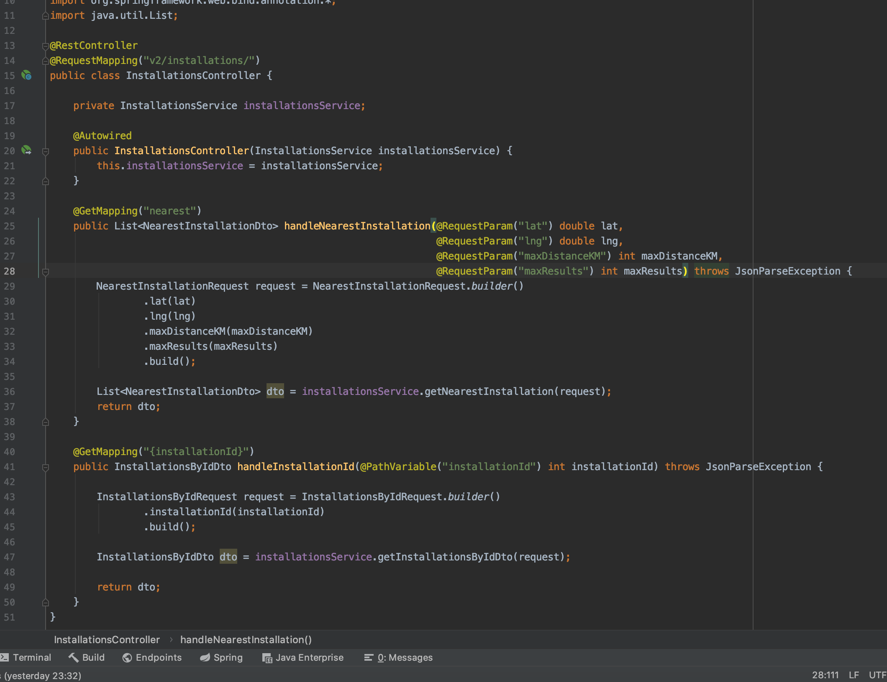

# weatherCheckApp - simple app
> Console client for Airly API (https://map.airly.eu/)!

## Table of contents
* [General info](#general-info)
* [Technologies](#technologies)
* [Features](#features)
* [Status](#status)
* [Inspiration](#inspiration)
* [Contact](#contact)

## General info
This app applies to Airly API version 2.0.

## 


## Technologies
* JAVA - version 8
* Spring Boot - version 2.5.0
* Spring MVC 
* Spring ReST
* HTTP protocol
* Spring ReST


## Code Examples
Examples of usage:


```
{

COMMING SOON

}
```

## Features
List of features ready:
* TEST Junit
* TEST Mockito


To-do list:
* For future development create a database 

## Status
Project is: 
_in progress_ :)

## Inspiration
Project inspired by FairIT. 

## Contact
Created by [@Agula2018] - feel free to contact me!
