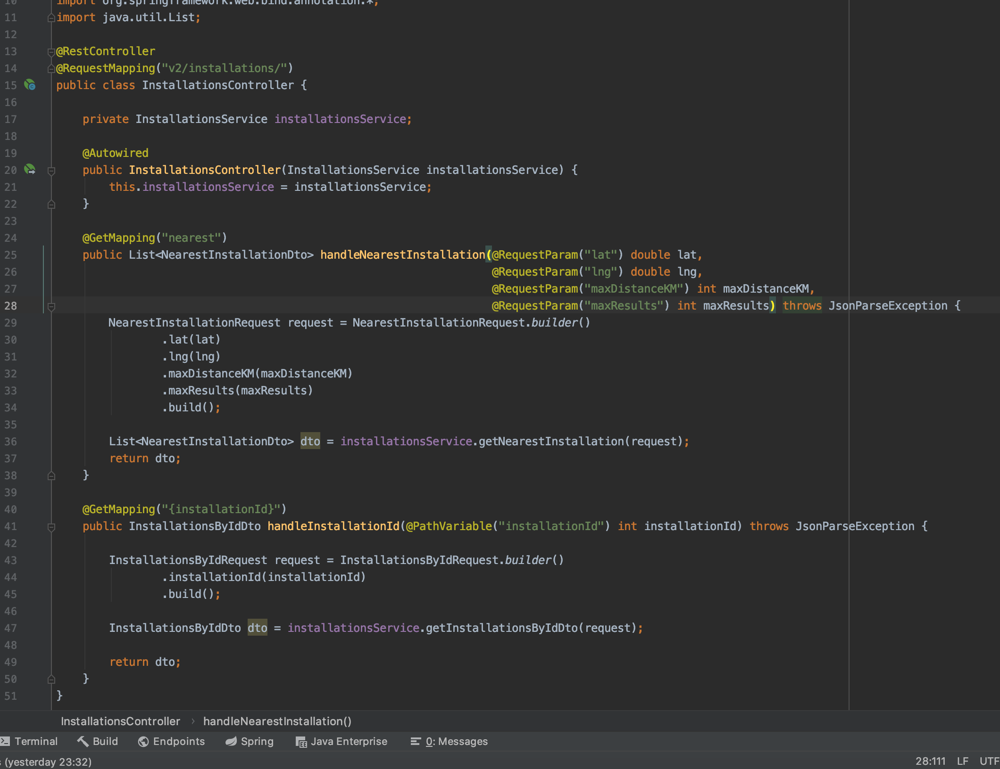
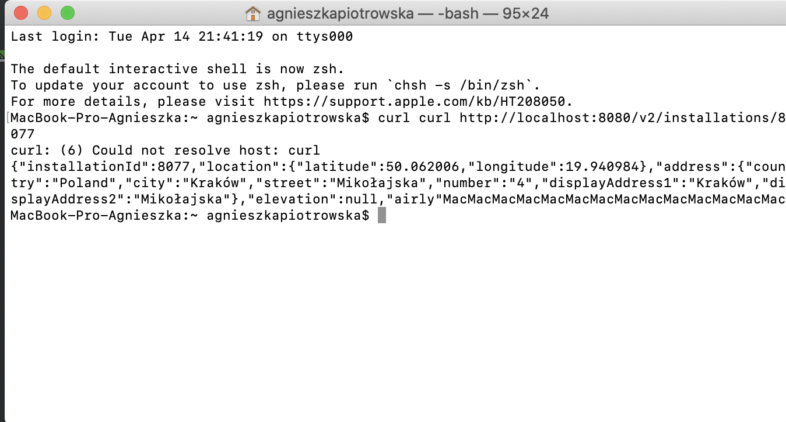

# weatherCheckApp - simple app
> Console client for Airly API (https://map.airly.eu/)!

## Table of contents
* [General info](#general-info)
* [Technologies](#technologies)
* [Features](#features)
* [Status](#status)
* [Inspiration](#inspiration)
* [Contact](#contact)

## General info
This app applies to Airly API version 2.0 based on REST and organized around resources (Installations and Measurements). App is built-in HTTP features for issuing requests (HTTP methods) and handling errors (HTTP statuses).

WeatherCheckApp interact with Airly API from a client-side web applications served.

App interact with Airly API endpoints which return content in JSON format (including errors) which are mapped to JAVA object. App return mapped endpoints: Installations and Measurements.

## 

## Technologies
* JAVA - version 8
* Spring Boot - version 2.5.0
* Spring MVC 
* Spring ReST
* HTTP protocol
* Spring ReST

## Code Examples
Example of usage controllers:

Example of console output:

## Features
List of features ready:
* TEST Junit
* TEST Mockito

To-do list:
* For future development create a database 

## Status
Project is: 
_ready to use_:)

## Inspiration
Project inspired by lovely people. 

## Contact
Created by [@Agula2018] - feel free to contact me!
